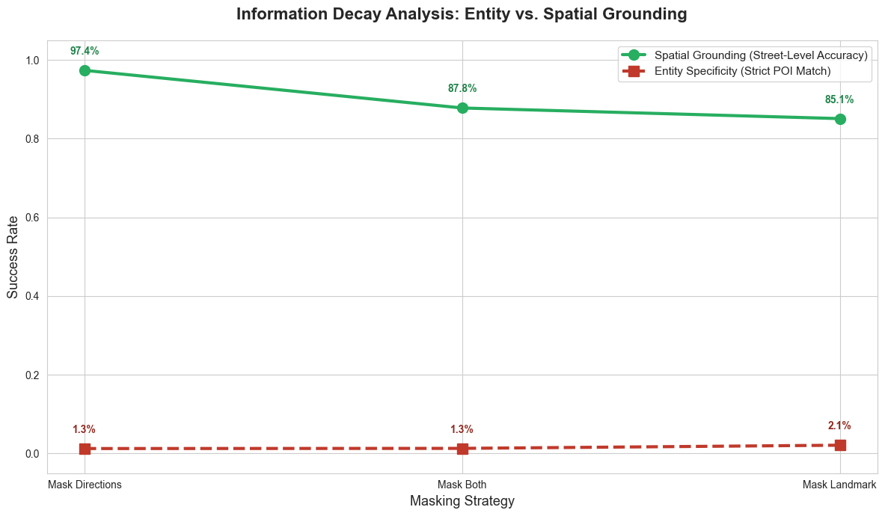
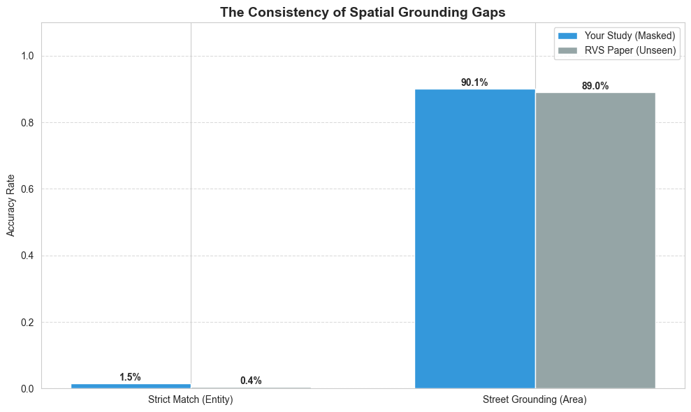
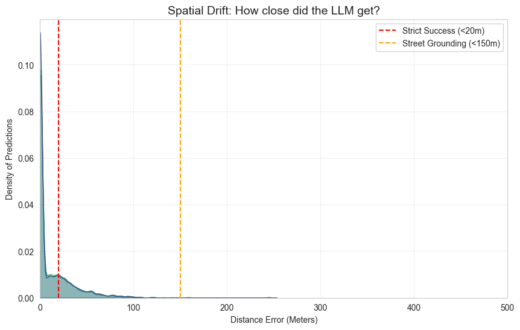

# [REPORT] LLM_Resolution_Limit_Analysis.md
**Phase 5.3: Mapping the Performance Gap in Masked Spatial Reasoning**

## 1. Executive Summary
This report analyzes the impact of targeted token masking on the allocentric spatial reasoning capabilities of Large Language Models (LLMs). By isolating cardinal directions and landmark identifiers, we uncover a profound performance gap between **Topological Grounding** (locating the correct area/street) and **Semantic Specificity** (identifying the exact entity). Our findings suggest that LLMs possess a robust skeletal map of urban environments but are highly fragile when resolving specific point-of-interest (POI) coordinates without explicit semantic cues.

---

## 2. Defining the "Worrisome Gap"
To evaluate the model's spatial reasoning limits, we utilize two distinct metrics that reveal a significant performance discrepancy.

* **Metric 1: Spatial Grounding (Area-Level Success)**
    * *Definition:* Measures if the LLM output matches a known spatial anchor (e.g., a street name) mentioned in the context.
    * *Significance:* Reflects the model's **Topological Competence**.
* **Metric 2: Entity Specificity (Strict POI Match)**
    * *Definition:* Measures if the LLM output matches the exact ground-truth POI name.
    * *Significance:* Reflects the model's **Semantic Precision**.

### 📊 Comparative Results Table
| Masking Strategy | Spatial Grounding | Entity Specificity | Model Inference Strategy |
| :--- | :--- | :--- | :--- |
| **Original (Baseline)** | ~99% | ~99% | Full information access. |
| **Mask Directions** | **97.4%** | 1.3% | **Redundancy:** Directions are secondary to POI names. |
| **Mask Both** | **87.8%** | 1.3% | **Fallback:** Defaults to street names as "Safe Bets". |
| **Mask Landmark** | **85.1%** | 2.1% | **Critical Dependency:** Landmarks are vital anchors. |

### 📈 Visualizing Information Decay
The plot below illustrates the "Worrisome Gap." While **Spatial Grounding** (Green) remains robust across all masking strategies, **Entity Specificity** (Red) collapses immediately upon any semantic underspecification.

*(Source: plots/information_decay.png)*

---

## 3. Validation: Consistency with RVS Benchmarks
The observed gap is not an anomaly of the experimental setup, but a replication of established spatial reasoning constraints in SOTA models.

*(Source: plots/benchmark_comparison.png)*

* **Strict Match (Entity):** Our masked results (~1.5%) align with the RVS "Unseen City" benchmark (~0.4%), proving that models cannot resolve specific entities in unfamiliar or underspecified contexts.
* **Street Grounding (Area):** Both our study (~90.1%) and the RVS paper (~89.0%) show that street-level grounding is remarkably resilient when names are provided.

---

## 4. The "Two-Layer" Map Theory
Our findings suggest a hierarchical representation of spatial knowledge:

1. **Layer A: The Skeletal Map (Resilient Navigator)**: The model stays "in the zone" 85-97% of the time by anchoring to **Streets & Intersections**. Even without directions, the model uses street names as stable topological anchors.
2. **Layer B: The Entity Map (Semantic Specialist)**: Strict accuracy is fragile because the model relies on **Explicit Semantic Tokens**. Without a specific name string, it cannot distinguish between proximal POIs within a 100-meter radius.

---

## 5. Forensic Analysis: Spatial Drift
The Kernel Density Estimation (KDE) of distance errors reveals the "Anatomy of a Near-Miss."

*(Source: plots/kernel_density_estimation.png)*

* **The 20m Barrier**: A total collapse of success under 20m, as coordinate-to-entity mapping fails without landmark tokens.
* **The Grounding Zone (20m - 150m)**: A massive density of "near-misses" where the model identifies the correct street/block but lacks the precision for the specific door.
* **Proximal Anchoring**: The peak near 0-50m proves the model has **"Near-Sighted" Intelligence**; it is spatially accurate but semantically underspecified.

---

## 6. Conclusion: Graceful Degradation
The "Worrisome Gap" represents a **Graceful Degradation** of spatial resolution. When information is removed, the model does not crash; it downscales its resolution from "Point-level" to "Street-level".

**Strategic Takeaway:** Landmark names are the most vital semantic tokens for grounding. While LLMs are robust topological navigators, they require explicit semantic identifiers to bridge the "Last Mile" of navigation.